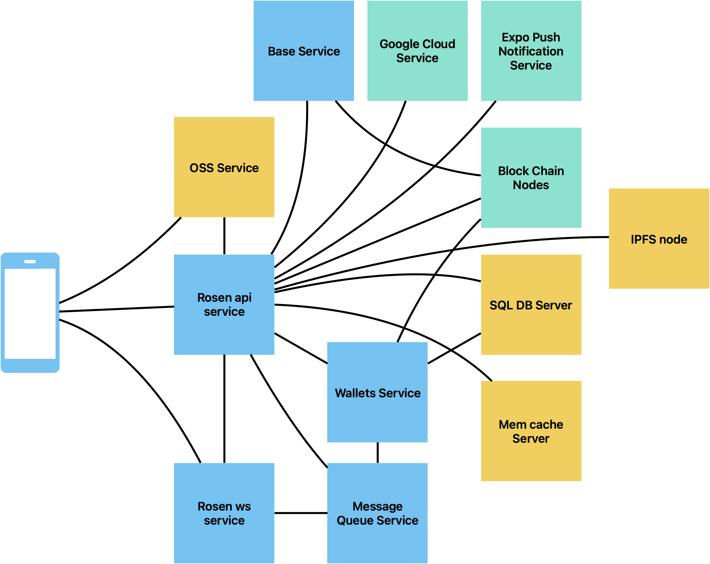

# Rosen X Base

## 🌹 ROSEN × Base

The Next-Gen Social Economy App  
Seamless global connections, powered by stablecoins on Base!  

## 🏆 Why ROSEN × Base?  

Base's near-zero gas fees, compliance-ready environment, and Coinbase's fiat rails make it the perfect home for ROSEN's vision of borderless social economies.  

## 🔥 The Problems We Solve  

1. Isolated Communities  
  - Base members struggle to find specific regional connections, especially for events or traveling  

2. Global Recruitment Friction  
  - Ecosystem projects face language/payment barriers when hiring globally

3. Onboarding Challenges  
  - Traditional apps can't offer gasless microtransactions or instant USDC rewards
  - Most web3 app are not live on the App Store  

## 🚀 Our Base-Specific Solutions  

🌍 Base GPS Social Map

- Email login without web3 jargon, turn every email user to a base node
- Exclusive NFT avatars for Basenames holders  
- Real-time location-based discovery of Base community members  
- "Same-skin" recognition for instant trust connections  

🏙 Base Community Lands

- Dedicated virtual plots for Base ecosystem projects   
- AI-translated group chats (supports 50+ languages)  
- Gasless USDC rewards for participation in community activities  

💼 Global Talent Hub

- Permissionless in-app DMs for a easy and open global talent hub
- AI-translated chats with in-conversation USDC payments (no gas token needed)  
- 100 Coins = 1 USDC (gasless on Base) instant rewards system
- Walletconnect links user's private (non-custodian) wallet for USDC withdrawal in 1 click


---

## ✨ Key Features

| Feature                     | Tech Stack                   | Competitive Edge                   |  
|-----------------------------|------------------------------|------------------------------------|  
| 1-Click Base Onboarding     | Wallet Abstract + Base RPC   | No seed phrases, just social login |  
| Gasless Microtransactions   | Batch Transactions           | Send $0.10 USDC easily as a text   |  
|Cross-border Social Economy  |AI Translation + In-Chat $USDC| Pay global talent in 20 sec        |  
| Base NFT Avatars            | ERC-6551 + GPS Mapping       | Visual identity of Basename holders|  


---

## 📊 Why This Matters to Base
1. Eliminate language and payment barriers for global interaction
   
| Metric                   | Traditional Apps     | ROSEN × Base                         | 
| -------------------------|----------------------|--------------------------------------| 
| Min. Transfer            | $10+                 | $0.10                                | 
| Gas Fees                 | $1+ per tx           | $0 (covered by Rosen)                | 
| Settlement Time          | 1-5 days             | 20 sec                               | 
| Global Reach             | Single-language      | AI-translated for 50+ languages      | 

3. Expands Base's Ecosystem  
  - Onboards non-crypto users through social-first experience  
  - Enable every gmail user to a Base user on-chain
    
3. Creates New Use Cases  
  - Turns global social interactions into economic opportunities with stablecoins on Base (USDC)


---

## 🛠️ Setup & Run

Architecture



### Quick Start

You can download our App from App Store / Google Play for a quick experience.

And you can also download the Beta Version for new features.

## Build & Run Client

```
cd client
npm i
npm run dev
```

### Build & Run Server

1. requirements:

- golang >= 1.23.4
- mysql >= 8.0
- redis

2. build

cd server-contract
go mod download
go build

2. Edit config.yaml with your favorate editor. e.g. vim

```
vim config.yaml
```

3. Launch for first time.

```
./rosen-apiserver server --config config.yaml --migratedb yes
```

---

## 🚀 Future Roadmap

- Base-native USDC on/off ramps via Coinbase integration  
- Base ecosystem project token integrations  
- Decentralized reputation system for ambassadors  


---

## 📜 License  

MIT

We're not just building a social app - we're creating the economic infrastructure for Base's global community.  
